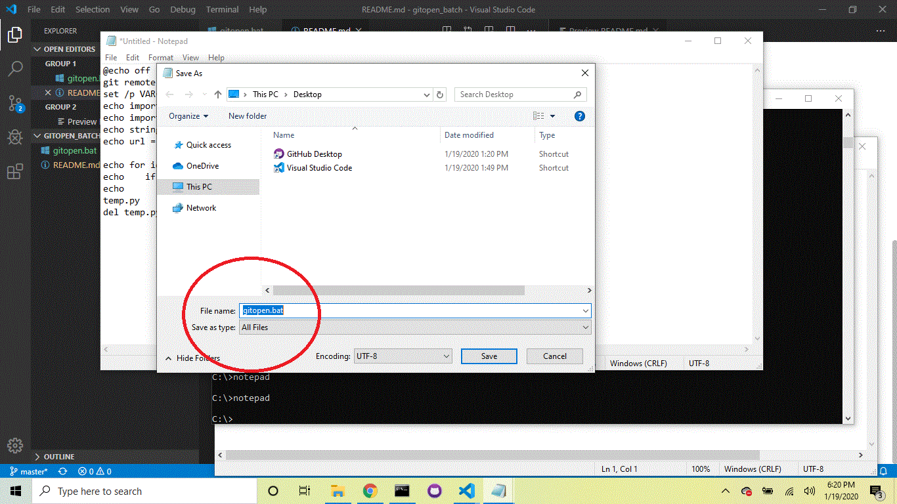
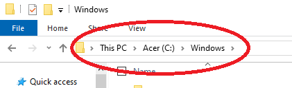
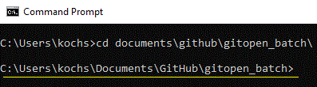

# gitopen - batch file (Windows & Python)
Author: Stephen Koch
Version 1.0.0
# Description
Using the DOS command prompt removes a ton of functionality that unix and linux provides BUT it also removes many more variables to parse through when debugging. I made this for my windows machine for when I am using Windows command prompt. 

When you type <b>'gitopen'</b> into the DOS command prompt it will open the current github repository at the origin root. I am using python and regular expressions to parse the url and "start" the url.

# Usage
Python 3.6 or greater is required to use f-strings.

Make sure that you have a current version above 3.6 for use:
```
C:\> python -V  (uppercase)
Python 3.8.1
```
If you do not, you can install the current version of Python [here](https://www.python.org/downloads/windows/). Make sure that you select box for "adding Python to your PATH". 

You can open your notepad from your Windows command prompt by typing 'notepad'. ```C:\> notepad``` You can paste the contents of [gitopen.bat](gitopen.bat) into the notepad.

Batch files can be saved to the Windows directory on C:\ and that is where your PATH is looking for internal or external commands, operable programs, or batch files. The Windows directory is a protected directory and will need permissions.

The easiest thing to do with your Untitled new notepad is to save it to your Desktop as 'getopen.bat'.



Without changing any permisions at all, we can move this file into our C:\Windows directory. Open the File Explorer and navigate to your C:\ drive and navigate into the "Windows" directory.



You can then move your newly saved notpad file 'gitopen.bat' to the Windows directory by draging the file over from the Desktop into the File Explorer window. You will need to accept the move as administrator (prompt should pop up).

Now we can try it out; from the Windows Command Prompt, navigate to an existing repository you have locally.



When you type 'gitopen' your browser will open up a new tab that takes you to the root of your repository. :)